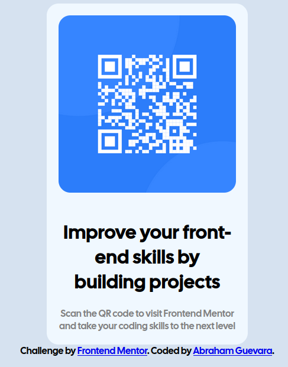

# QR Code Component 📱

Solución al reto [qr-code-component](https://www.frontendmentor.io/challenges/qr-code-component-iux_sIO_H) de Frontend Mentor.

## 🔗 Links

- 🌐 Demo en vivo: [GitHub Pages](https://o0vanfanel0o.github.io/QR_Code/)
- 💻 Repositorio: [GitHub](https://github.com/o0VanFanel0o/QR_Code)

## 📸 Vista previa

## 🛠️ Tecnologías

- HTML5 semántico
- CSS3 — Flexbox, border-radius, box-shadow

## 🎯 Lo que aprendí

- Centrar elementos en pantalla con Flexbox
- Crear tarjetas con bordes redondeados y sombras
- Estructurar componentes simples con HTML semántico

## 👤 Autor

- GitHub: [@o0VanFanel0o](https://github.com/o0VanFanel0o)
